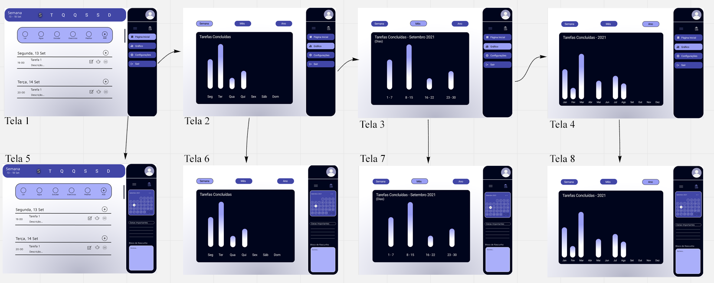

# Projeto de Interface

> Em uma das etapas do Design sprint, o grupo entrevistou potenciais usuários que
> nos conduziram a ter em mente um interface que preze pela facilidade e interatividade para
> atender os diversos perfis abrangidos pela nossa aplicação.

## User Flow

> O fluxo de Interação do usuário é representado no diagrama abaixo.
> Para acessar o wireframe interativo clique <a href="https://www.figma.com/proto/kEwo0XUwztCRyyTST92P4P/Pagina-Principal?node-id=1%3A2&starting-point-node-id=1%3A2" target="blank">aqui</a>.

<!--teste-->
## Wireframes

> São protótipos usados em design de interface para sugerir a
> estrutura de um site web e seu relacionamentos entre suas
> páginas. Um wireframe web é uma ilustração semelhante do
> layout de elementos fundamentais na interface.
> 
> 
<!-- - [Ferramentas de Wireframes](https://rockcontent.com/blog/wireframes/)
 - [MarvelApp](https://marvelapp.com/developers/documentation/tutorials/) -->
