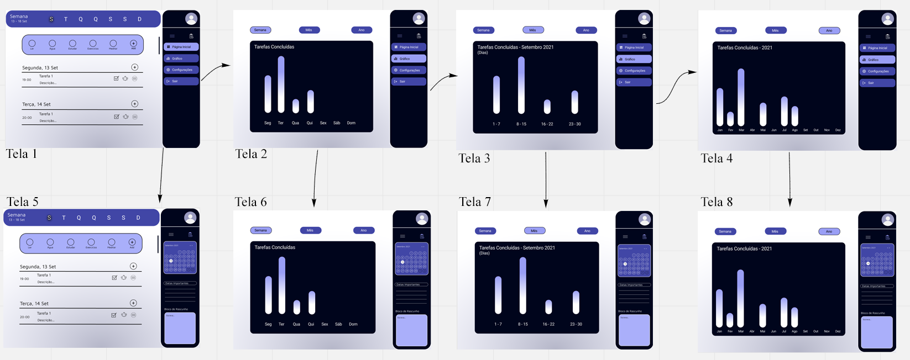

# Projeto da Solução

Pré-requisitos: <a href="4-Gestão-Configuração.md"> Ambiente e Ferramentas de Trabalho</a>

## Tecnologias Utilizadas

> Descreva aqui qual(is) tecnologias você vai usar para resolver o seu
> problema, ou seja, implementar a sua solução. Liste todas as
> tecnologias envolvidas, linguagens a serem utilizadas, serviços web,
> frameworks, bibliotecas, IDEs de desenvolvimento, e ferramentas.
> Apresente também uma figura explicando como as tecnologias estão
> relacionadas ou como uma interação do usuário com o sistema vai ser
> conduzida, por onde ela passa até retornar uma resposta ao usuário.
> 
> Inclua os diagramas de User Flow, esboços criados pelo grupo
> (stoyboards), além dos protótipos de telas (wireframes). Descreva cada
> item textualmente comentando e complementando o que está apresentado
> nas imagens.

## Arquitetura da solução

> Inclua um diagrama da solução e descreva os módulos e as tecnologias
> que fazem parte da solução. Discorra sobre o diagrama.

O usuário irá iniciar seu teste pela página inicial (Tela 1) onde ele irá possuir as opções de prosseguir para tela onde ele irá poder ver os gráficos e ir para a parte de agenda que irá substituir o menu (Tela 5).

Caso o usuário escolha ir para a agenda(Tela 5), ele ainda sim irá possuir acesso aos gráficos, porém, terá de selecionar novamente a opção do menu (direcionando para a Tela 1), assim, tendo opções aos botões, selecionando os gráficos(Tela 2).

Caso ele vá para a parte de gráficos, o usuário irá ver os gráficos de tarefas concluídas, possuindo sempre a opção de ver sua agenda (Tela 6), e conseguir ter a visualização do gráfico ao mês (Tela 3) e a visualização do gráfico ao ano (Tela 6), e caso ele vá para a visualização de mês, ele poderá ver a agenda (Tela 7), também se aplicando a visualização ao ano (Tela 8).

O usuário também poderá voltar para a tela principal ou ter outro tipo de visualização do gráfico clicando em seu botão respectivo.

